# 基于VM虚拟机下的kali linux 2023.3版本安装教程

## 百度网盘资源
 + 通过网盘分享的文件：kali-linux-2023.3-vmware-amd64.7z
链接: https://pan.baidu.com/s/1P1nMedStnKCiwKxaeneG7w?pwd=mq9s 提取码: mq9s 
--来自百度网盘超级会员v4的分享
 + 文件命名：kali-linux-2023.3-vmware-amd64.7z

## 虚拟机安装
 + 解压缩：
 

   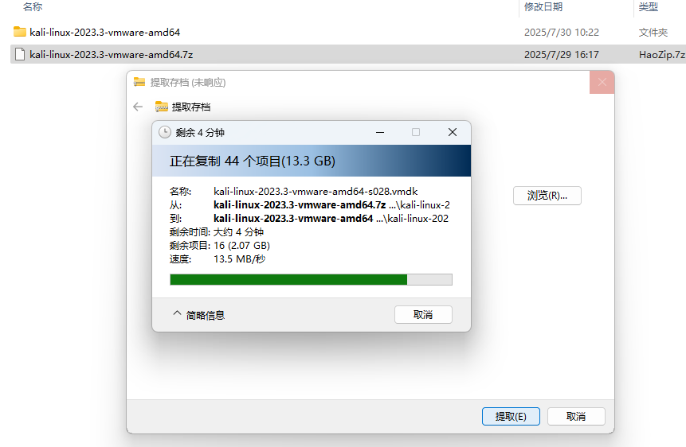 


 + 已经是安装后完整系统，可不用手动安装，VM虚拟机打开.vmx 即可
 + 进入登录界面：
  

   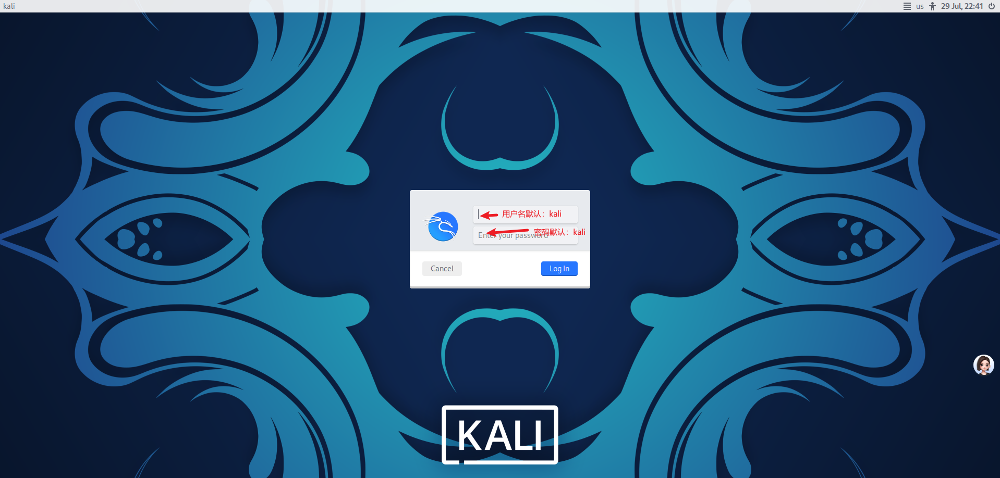 


 + 初始化默认用户名和密码：kali

## 系统重置root密码以及环境配置
参考CSDN文章：《Kali Linux安装教程》
地址：https://blog.csdn.net/aaheguosong/article/details/133897793
  - 设置root账户
    - shell命令
    ```
      sudo passwd root
    ```
    - 先输入kali密码，再输入新密码，最后再次输入新密码
  
  
      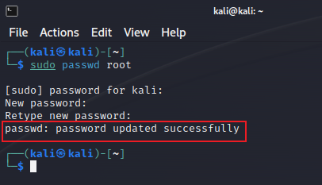


    - 提示：passwd: password updated successfully 即可
    - 重启切换root账户

  - 设置kali源
    - 后续使用kali系统的时候需要安装一些软件，默认的软件源地址是：http://http.kali.org/kali。 这个地址的服务器在国外，有时候我们连接不上，所以需要将它修改成国内的地址。
    - 点击桌面上的“File System”图标：


      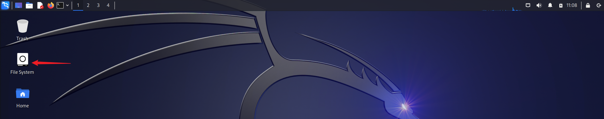


    - 依次打开etc、apt文件夹，可以找到sources.list文件，将这个文件打开：


      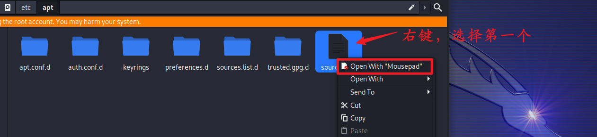


    - 删掉原来第二行的内容，然后添加下面两行内容：
      ```
      deb http://mirrors.ustc.edu.cn/kali kali-rolling main non-free contrib
      deb-src http://mirrors.ustc.edu.cn/kali kali-rolling main non-free contrib
      ```

    - 效果如下：


      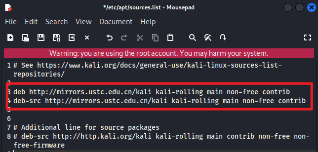


    - 点击File->Save,保存这个文件，退出即可:
  
      
      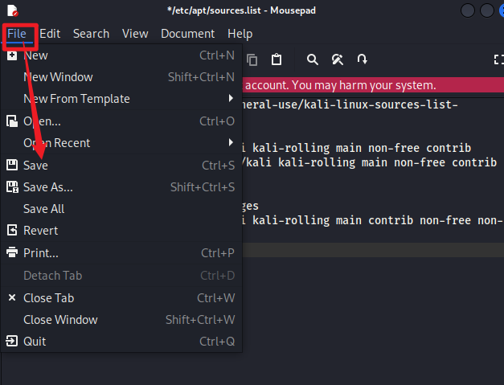


    - 再打开一个终端，输入：
      ```
      apt update
      ```
    - 此时，已经将源文件换成国内的了:


      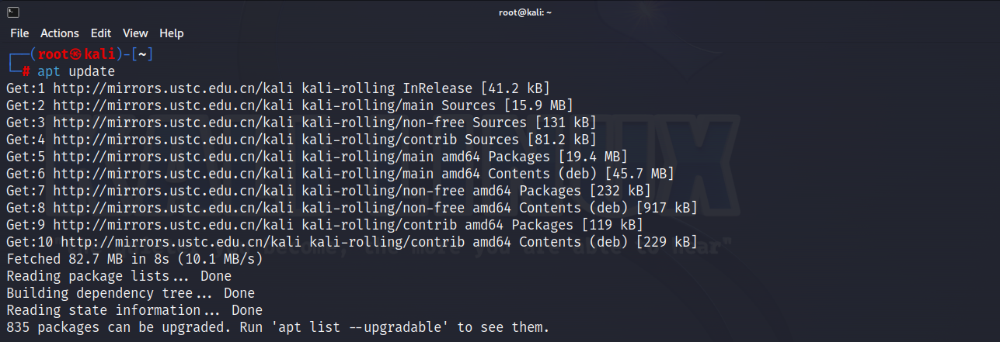

  
  - **设置kali源时可能会出现的报错：**
    + GPG 密钥缺失问题：


      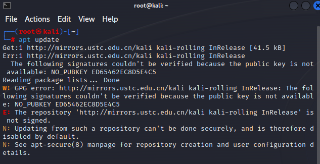

      
      解决方案：
      - 直接添加缺失的密钥（推荐）
        - 下载缺失的密钥
          ```
          sudo apt-key adv --keyserver keyserver.ubuntu.com --recv-keys ED65462EC8D5E4C5
          ```
      - 永久修复：成功更新后，建议安装完整密钥包：
        ```
        sudo apt install kali-archive-keyring
        ```
      - 重新更新
        ```
        sudo apt update
        ```
  - 安装dsniff
    - 终端命令：
      ```
      apt install dsniff
      ```
  - **安装dsniff时可能会出现的报错：**
    - 安装 dsniff 时出现了依赖关系冲突，主要与 kali-desktop-xfce 和 kali-desktop-core 相关：
    
    
      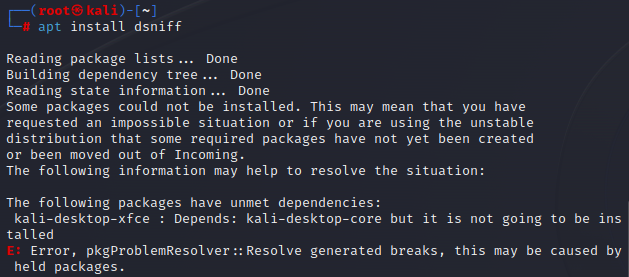

    
      解决方案：
      - 手动安装核心桌面依赖
        - 如果错误明确指向 kali-desktop-core：
          ```
          sudo apt install --reinstall kali-desktop-core
          ```
        - 成功后再安装 dsniff：
          ```
          sudo apt install dsniff
          ```
  - 命令：
    ```
    apt-cache show dsniff
    ```
  - 看到dsniff的安装情况,即完成：
  
  
    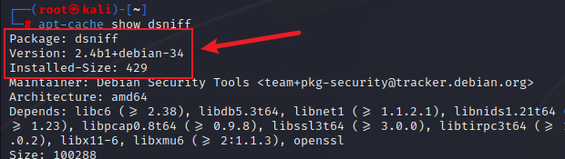


## 重装vmtools
  - 命令：
    ```
    sudo apt-get install open-vm-tools-desktop
    ```
  - 重启生效

## 汉化

 - 终端命令：
   ```
   sudo dpkg-reconfigure locales
   ```
 - 键盘↓键一直下滑至 zh_CN.UTF-8 UTF-8 空格键选中，tab键选中OK，回车键
   
   
   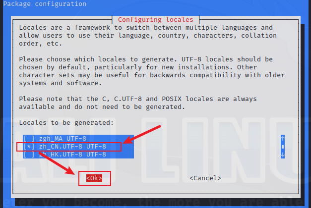


 - 键盘↓键选中 zh_CN.UTF-8 ，tab键选中OK，回车键
   
   
   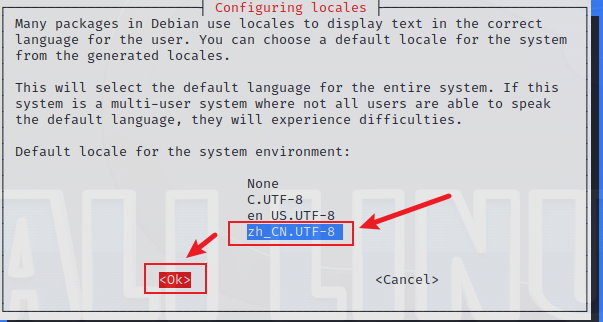


 - 重启生效
  
## 配置中文输入法
 - 安装fcitx
   ```
   sudo apt install fcitx fcitx-config-gtk fcitx-tools fcitx-frontend-gtk2 fcitx-frontend-gtk3
   ```
 - 安装中文输入法
   ```
   sudo apt install fcitx-sunpinyin
   ```

## 安装vscode
 - 官网下载：https://code.visualstudio.com/
  
  
    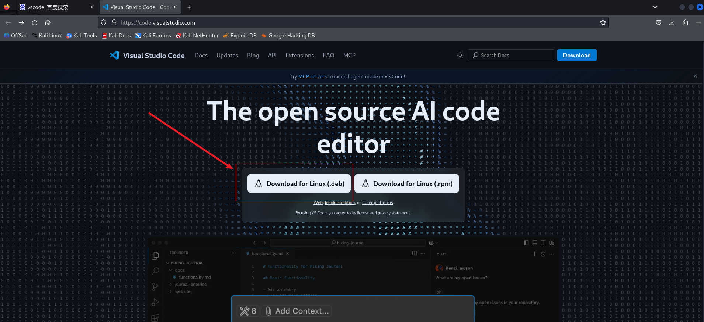


 - 完整安装流程：
  - bash
    ```
    # 1. 进入目录
    cd /root/vscode

    # 2. 安装必要依赖
    sudo apt update && sudo apt install -y libgtk-3-0 libnss3 libxss1 libasound2

    # 3. 安装VS Code
    sudo dpkg -i code_1.102.3-1753759567_amd64.deb

    # 4. 修复依赖
    sudo apt --fix-broken install -y

    # 5. 创建桌面快捷方式
    echo '[Desktop Entry]
    Name=Visual Studio Code
    Comment=Code Editing. Redefined.
    Exec=/usr/share/code/code --no-sandbox
    Icon=code
    Type=Application
    Terminal=false
    StartupWMClass=Code' > ~/Desktop/VSCode.desktop
    chmod +x ~/Desktop/VSCode.desktop

    # 6. 启动验证
    code --version

    # 7.编辑启动器 -- 命令替换
    /usr/share/code/code --no-sandbox --user-data-dir=/root/.vscode-root %F
    ```
- 必备插件
  - Chinese（中文包）
  - C/C++
  - lua
  - markdown
  - vue

## 安装微信
 - 命令安装：
   ```
   sudo dpkg -i WeChatLinux_x86_64.deb
   ```
 - 报错安装：
   ```
   sudo apt install -f
   ```
 - 命令启动：
   ```
   wechat
   ```
   或直接双击图标启动

## 安装node.js
 - 命令安装：
   ```
   apt-get install nodejs
   apt install npm
   ```
 - 验证安装：
   ```
   nodejs --version
   npm --version
   ```


